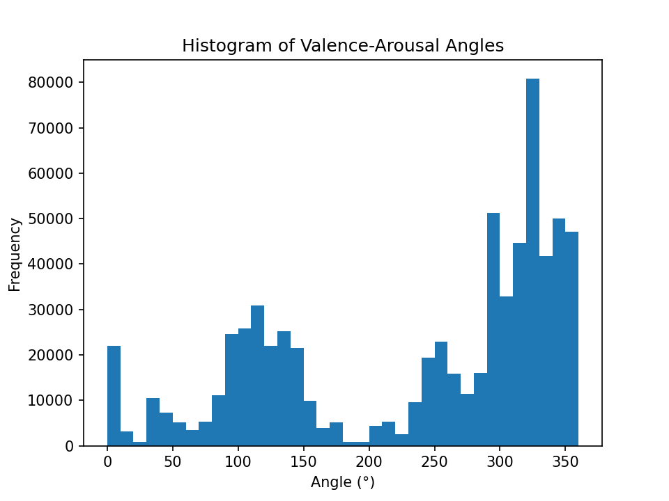
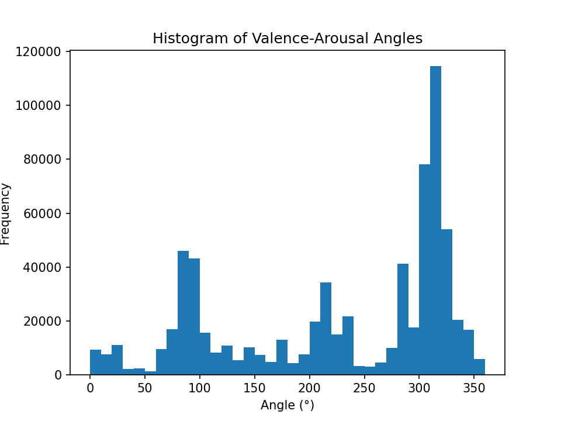

# Data Overview

> [Note!] This chapter was mainly formulated on information provided by the AVR Porject documentation. 

## EEG Data
The dataset consists of 54 subjects each with a measurement of 23 minutes with a 64 channel EEG. 

### Data Processing Pipeline

The EEG data processing follows a comprehensive pipeline that transforms raw LSL-output format (`.xdf`) files into analysis-ready datasets using BIDS-compatible structure. 

### EEG Signal Processing

The EEG preprocessing pipeline implements a robust multi-stage approach to ensure high-quality neural signal extraction:

**Initial Processing:** Raw EEG data undergoes cropping of 2.5 seconds from both start and end to eliminate edge artifacts that commonly occur during recording initiation and termination.

**Signal Cleaning:** The cleaning process involves several critical steps. Power line interference is removed at 50 Hz, followed by re-referencing to the average across all channels to reduce common noise. Band-pass filtering between 0.1 and 45 Hz isolates the neurophysiologically relevant frequency range while removing low-frequency drift and high-frequency noise.

**Epoch Processing:** The continuous EEG signal is segmented into 10-second epochs for systematic analysis. Bad channels and epochs are identified and either rejected or interpolated using the `autoreject` algorithm applied to 1 Hz-filtered data, ensuring optimal data quality while preserving maximum usable data.

**Artifact Removal:** Independent Component Analysis (ICA) is employed to identify and remove physiological artifacts including eye movements, cardiac interference, and muscle activity that can contaminate neural signals.

**Quality Control:** A final threshold check excludes participants with more than 30% noisy epochs remaining after preprocessing, ensuring only high-quality datasets proceed to analysis.

## Behavioural Data

Using a internally developed davice the participants continuously labeled their emotional states. 

The input from these devices was transformed to a valence arrousal scale that is synchronized to the eeg data. 

### Challenges
- **Incomplete Emotional Coverage**: For example, in the case of sub-001 and sub-002, visualizations show that participants did not experience (or at least did not label) the full emotional spectrum in equal amounts. 
- **Data Imbalance and Inter-Subject Variability:** There is a clear imbalance in the data, with certain emotion zones underrepresented. Additionally, strong personal differences in how emotions were experienced and reported create further complexity.
- **Potential Mislabeling:** It is possible that participants did experience the full range of emotions but failed to label them correctly. This presents a validation challenge, as we have no ground truth to verify the accuracy of self-reported emotional states.

e.g sub-001 valence

e.g sub-002 valence 

#### VR-Specific Challenges
**Participant Experience Effects**:
- VR sickness can confound emotional responses
- Novelty effects may overshadow target emotional content
- Individual differences in VR adaptation and comfort
- Dual-task interference from continuous emotional labeling