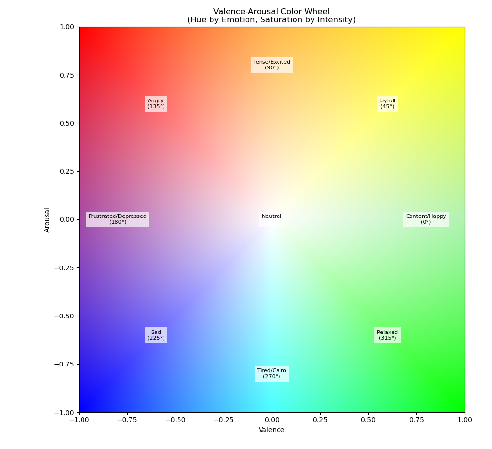
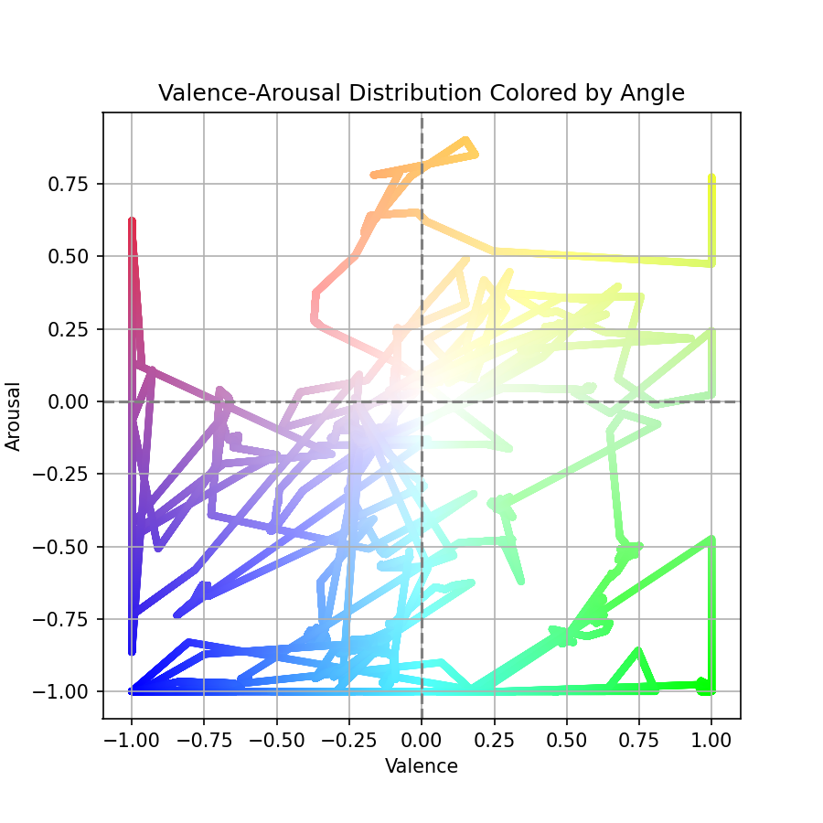
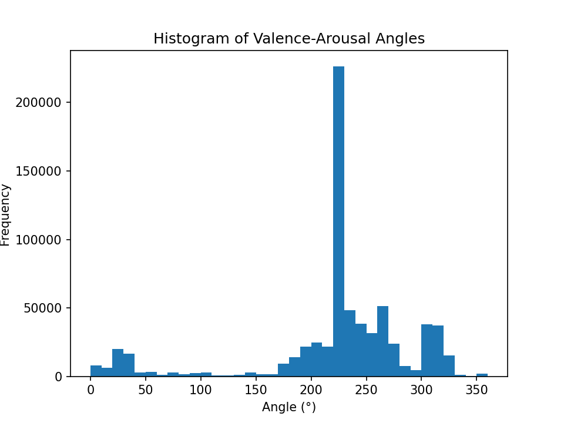

# Inital Exploration of EEG Emebddings

## Overview
The initial phase of this project focused on exploring neural embeddings learned from preprocessed EEG data using the CEBRA (Contrastive Embedding for Behavioral and neural Representation Analysis) framework. This step served as an unsupervised, exploratory analysis to evaluate the latent structure of neural activity and its variability depending on the selected EEG channels and subject identity.

---

## Objectives
* Test the CEBRA embedding framework on preprocessed EEG recordings.
* Investigate how the resulting embeddings vary across different channel subsets.
* Visualize the temporal dynamics of EEG representations in a reduced latent space.
* Establish a foundation for future extension and comparisons across subjects or conditions.

## Exploration
* **Channel Effects:** Preliminary visual differences were examined when using different sets of EEG channels (e.g., frontal vs. parietal).
* **Subject-Specific Embedding:** Analysis was limited to a single subject. Generalization across subjects will be addressed in future stages.
* **Signal Length:** Time series data length was considered for ensuring meaningful temporal embedding.

## Data Preparation

### Data loading
A custom data loading pipeline was implemented to handle both preprocessed (.fif) and raw (.edf) EEG file formats. The `load_subject()` function serves as the core loading mechanism, accepting a subject directory path and data type specification. For this analysis, preprocessed data in MNE-Python FIF format was utilized, specifically targeting files with the naming pattern `*before_ica.fif`, indicating data that had undergone preprocessing but prior to independent component analysis.

Preprocessed EEG data were loaded for a single subject (e.g `sub-020`) from a cleaned dataset directory. The data had already undergone necessary preprocessing (e.g., filtering, artifact removal, ICA), and therefore represent neural activity in a clean and interpretable form.The time series data were transposed and concatenated to form a matrix of shape `(n_timepoints, n_channels)`, suitable for input to the CEBRA model.

```python
picks = mne.pick_types(raw.info, eeg=True, eog=False)
data = raw.get_data(picks=picks).T  # shape: (n_times, n_channels)
```

Configurations tested include: 
* **Time cropping** to specific intervals or full session.
* **Frequency filtering** to extract EEG bands (theta, alpha, beta, gamma).
* **Cannel subset selection**  (frontal, central-parietal, combined, or all channels).

## Embedding via CEBRA

The CEBRA model was initialized with the following configuration:

* **Model architecture**: Offset-based temporal contrastive model (`offset10-model`)
* **Training mode**: Unsupervised (`conditional=None`)
* **Distance metric**: Cosine similarity
* **Latent dimensionality**: 3 (for visualization)
* **Hardware**: GPU used if available

```python
cebra_model = CEBRA(
    model_architecture="offset10-model",
    batch_size=512,
    learning_rate=3e-4,
    temperature_mode='constant',
    temperature=1.12,
    max_iterations=5000,
    conditional=None,
    output_dimension=3,
    distance='cosine',
    device="cuda_if_available",
)
```

After training, the latent representation of the EEG time series was computed:

```python
embedding = cebra_model.transform(X)
```

## Visualization

The embeddings were visualized using an interactive 3D scatter plot, with time used as the color gradient to illustrate temporal progression of brain states.

Due to the large number of timepoints, a **downsampling** step was applied before visualization to improve rendering performance and clarity

The resulting plot displays the trajectory of brain states over time in the learned latent space:

```python
fig = plot_embedding_interactive(
    embedding_small,
    embedding_labels=times_small,
    title="CEBRA Embedding (Brain States)",
    markersize=5,
    cmap="rainbow"
)
```
A custom valence-arousal color encoding system has been developed to visually represent affective states in the embedding plots. This system uses a circular color wheel encoding emotional states as hues by angle, combined with radial saturation to indicate intensity.

- The color wheel covers 0° to 360° angles, mapped to specific colors representing emotional states (e.g., green for joy, red for anger, purple for frustration).
- Radial distance from the center reflects affect intensity, with desaturation toward white for neutral or low intensity.
- Behavioral valence and arousal labels are interpolated to the EEG sampling frequency and used to generate corresponding RGB colors.

The embedding points were colored according to the valence-arousal color encoding from the behavioural labels, producing an interpretable affective latent space trajectory.


``` python 
colors = valence_arousal_emotion_color(valence_aligned, arousal_aligned)
colors_hex = np.array([mcolors.to_hex(c) for c in colors])
fig = plot_embedding_interactive(
    embedding_small,
    embedding_labels=colors_hex,
    title=fig_title,
    markersize=2,
)
```
Additional explorative plots for valence-arousal distributions and angle histograms are saved per configuration. 

e.g sub 005



## Next Step:

- **Multi-session shared embedding** Include additional subjects to assess cross-subject variability and potential alignment in the embedding space.
- **Multimodal embedding** Incorporate behavioral or event-based labels to train supervised embeddings using time-aligned contrasts.
* Quantify embedding quality using metrics like clustering, decoding accuracy, or neighborhood preservation.

