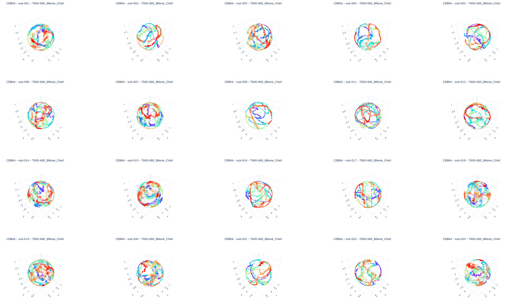
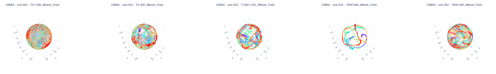
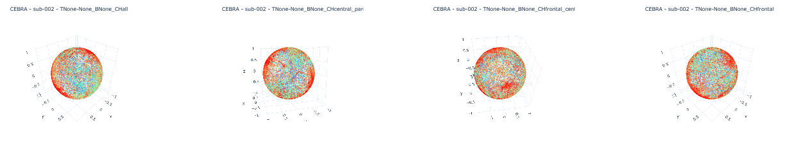
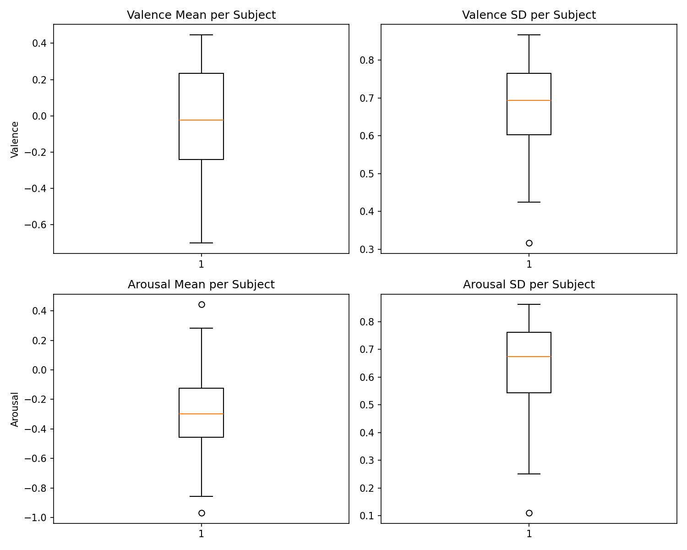

# Inital Results

This chapter presents a preliminary analysis of embeddings derived from CEBRA across different subjects and EEG channel configurations. The goal is to understand how neural variability is distributed in latent space and how different preprocessing choices impact the structure of the embeddings. The full interactive results can be viewed by running the dashboard.py script.

## single subjects embeddings

We first examine the embeddings from all subjects using all available EEG channels on the same snippet of 60s.

### Interpreson differencess
- trajectory complexity
- trajectory compactness (more or less dispersion per line)

### Round surface & Coils
The spreading accross the whole surfacesuggests that each video elicits a wide range of neural states, not just one “emotion point” in the embedding space. The brain state varies a lot within each video. Or, other cognitive factors (e.g., memory, attention, visual input) are interacting with the emotion, creating diverse brain activity.

### Colour Gradient (Temporal Encoding)

A clear color gradient exists in all embeddings—from red (early time points) to blue/purple (later time points). T

Time does not dominate the embeddings—there is no strict linear trajectory. Instead, time is diffusely spread, suggesting that non-temporal neural dynamics (e.g., emotional or cognitive processes) drive the main structure.  

## Single segments

e.g sub-002

## Channels Selection
Because participants engaged in multiple simultaneous tasks (e.g., monitoring devices, labeling videos), neural activity related to these non-emotional cognitive processes might be mixed into the EEG signal. Removing or selecting specific channels can help filter out neural signals related to attention, motor activity, or other cognitive demands that are not central to the emotional processing we want to isolate. To est if certain brain regions drive specific embedding geometries drive embedding structures, multiple channel subsets were tested in subject 020. 

Across all channel subsets:
- no changes in the in the geomertry of the embedding suggest that different regions do not carry different types/amount of intormation about the neural state space

# Assumption: emotion dominates
Participants watch a sequence of videos, each designed to elicit different emotions.

## Expectation
What we expected: 
- Distinct clusters = emotionally distincs states
    - embeddings form clear clusters, and each cluster corresponds to a particular video (or emotion). Sugessting that the brain enters qualitatively different neural states depending on the emotional content. The emotional processing is *strong* enough to produce separable neural dynamics.
- Smooth Trajectories = emotional transitions
    - embeddings form curved lines with temporal color gradient that form loops. Emotional stated evolve gradually and do not switch abrubtly. mixing and transitional states. continuous emotion space (e.g valence-arrousal)

## Results
What we got: 

What we got: Color Gradient
- all videos explore the full space. points are scattered across the whole space

## Control: Colouring with Valence Arrousal scores

- hue = different affective states
- saturation = intensity

