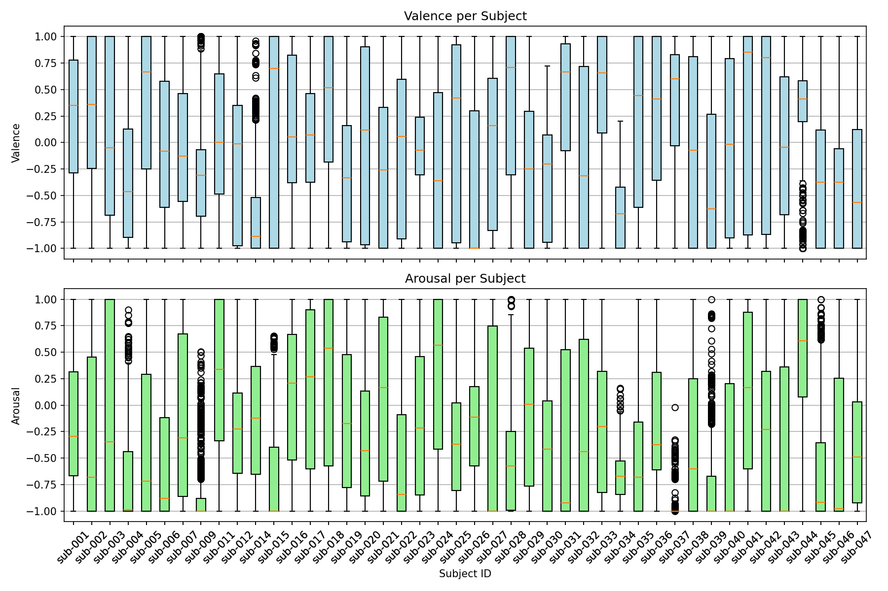

# Inital Results

This chapter presents a preliminary analysis of embeddings derived from CEBRA across different subjects and EEG channel configurations. The goal is to understand how neural variability is distributed in latent space and how different preprocessing choices impact the structure of the embeddings.

## single subjects embeddings

We first examine the embeddings from three subjects (e.g sub-001, sub-002, sub-020) using all available EEG channels.

sub-001 | sub-002 | sub-020 

### Flat  Shpere

The embeddings appear to lie on a curved but largely 2D surface (like a flattened sphere or disc) within 3D space.

All subjects consistently display a "flat sphere" shape in their embeddings—suggesting the data lie predominantly on a two-dimensional manifold within a three-dimensional space. This geometric constraint implies low intrinsic dimensionality of the neural data: most brain state variability can be captured by two dominant latent factors.

### Elongation
Elongation = Variance concentrated along one axis.

Elongated embeddings (e.g.sub-002) indicate that neural variability is dominated by a single primary latent dimension.

Rounder embeddings (e.g., sub-020) suggest a more balanced contribution from at least two latent dimensions.

### Colour Gradient (Temporal Encoding)

A clear color gradient exists in all embeddings—from red (early time points) to blue/purple (later time points). This gradient is radially distributed, with earlier points often clustered toward the center and later ones radiating outward. Two interpretations are considered:

- A technical property of CEBRA: embeddings may be initialized near the origin, then optimized to expand outward.
- participants might show higher focus or engagement early in the task

Time does not dominate the embeddings—there is no strict linear trajectory. Instead, time is diffusely spread, suggesting that non-temporal neural dynamics (e.g., emotional or cognitive processes) drive the main structure.  

The even spreading accross the whole planeuggests that each video elicits a wide range of neural states, not just one “emotion point” in the embedding space. The brain state varies a lot within each video. Or, other cognitive factors (e.g., memory, attention, visual input) are interacting with the emotion, creating diverse brain activity.

## Channels Selection
Because participants engaged in multiple simultaneous tasks (e.g., monitoring devices, labeling videos), neural activity related to these non-emotional cognitive processes might be mixed into the EEG signal. Removing or selecting specific channels can help filter out neural signals related to attention, motor activity, or other cognitive demands that are not central to the emotional processing we want to isolate. To est if certain brain regions drive specific embedding geometries drive embedding structures, multiple channel subsets were tested in subject 020. 

Across all channel subsets:

- The flatness and color gradient persist.
- The degree of elongation varies, suggesting some configurations emphasize specific latent dimensions more than others.

Changes in the geomertry of the embedding suggest that different regions carry different types/amount of intormation about the neural state space

### Frontal Channels

Subset: ['Fz', 'F3', 'F4', 'F7', 'F8', 'AF3', 'AF4', 'AFz']

The resulting embeddings are more rounded, particularly in the center. Suggests a more balanced distribution of neural variability across dimensions

### Frontotemporal Channels 

Frontal channels + T7, T8

Embeddings become more elongated and thinner, with reduced spread. This suggests that variability is dominated by a single, strong latent factor—likely tied to external sensory-emotional input. 

### Frontal-Parietal Channels

Subset: ['P3', 'P4', 'Pz']

The resulting embeddings are distinctly round and evenly spread. 

# Assumption: emotion dominates
Participants watch a sequence of videos, each designed to elicit different emotions (e.g., joy, sadness, fear, calm).

## Expectation
What we expected: 
- Distinct clusters = emotionally distincs states
    - embeddings form clear clusters, and each cluster corresponds to a particular video (or emotion). Sugessting that the brain enters qualitatively different neural states depending on the emotional content. The emotional processing is *strong* enough to produce separable neural dynamics.
- Smooth Trajectories = emotional transitions
    - embeddings form curved lines with temporal color gradient that form loops. Emotional stated evolve gradually and do not switch abrubtly. mixing and transitional states. continuous emotion space (e.g valence-arrousal)

## Results
What we got: Elongates shapes 
- the emebdding is treched along one direction
    - one primary emotional dimension dimunates (e.g either arousal or valence). brain's response scales along a principal dimension (e.g pleasantlness)

What we got: Color Gradient
- all videos explore the full space. points are scattered across the whole space
    - Each video causes movement through both high and low arousal states and
    - both positive and negative valence states.

## Alternatives

Parietal channels, associated with attention and sensory integration, produced the roundest embeddings. This implies that fluctuations in attentional focus or sensory processing, which may vary within and across videos, contribute strongly to neural variability.

Frontal and frontotemporal channels yielded elongated embeddings, which could reflect dominant latent factors related to task engagement, decision-making, or motor preparation rather than pure emotion.