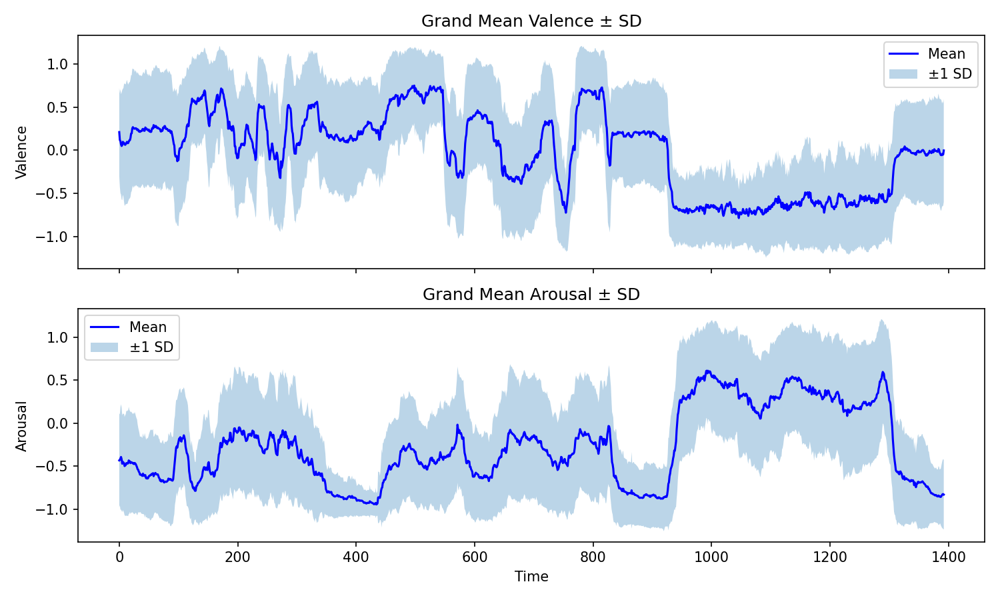
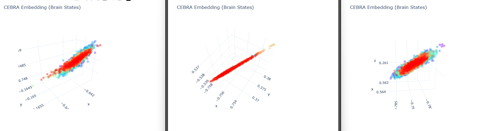
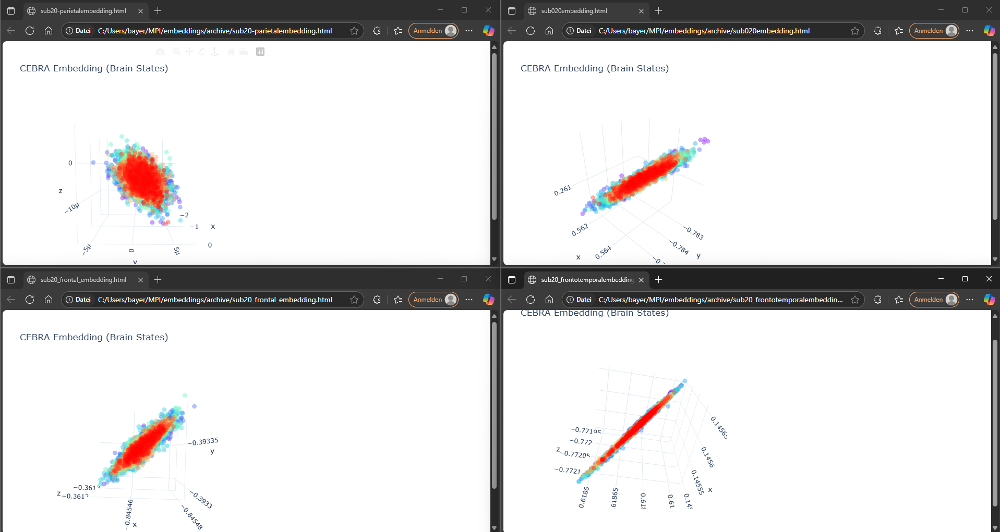
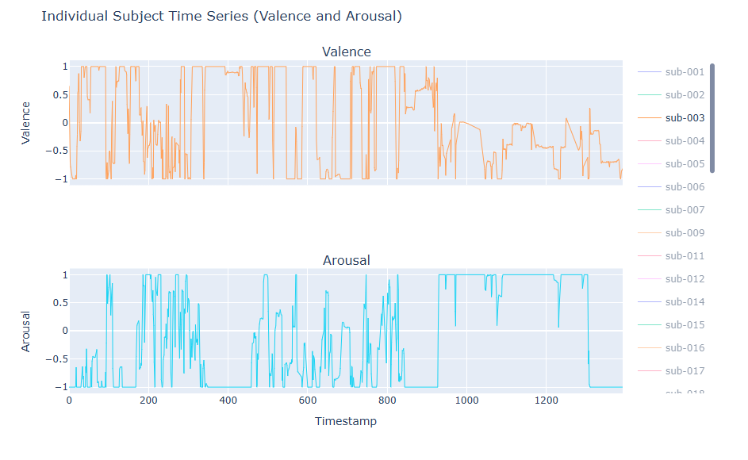
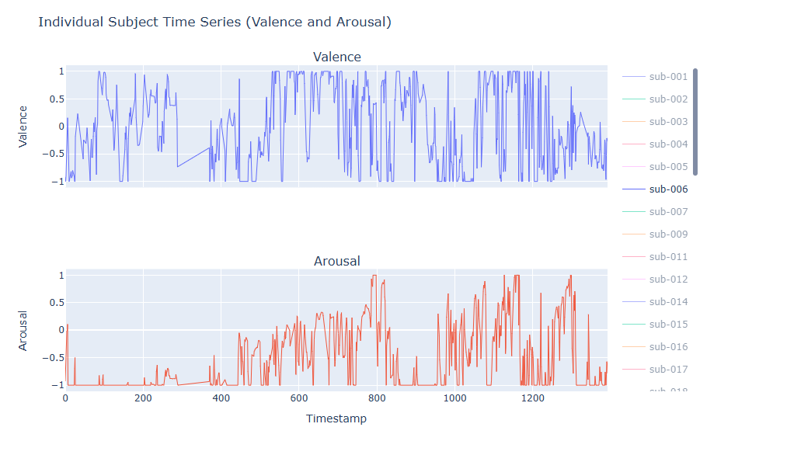
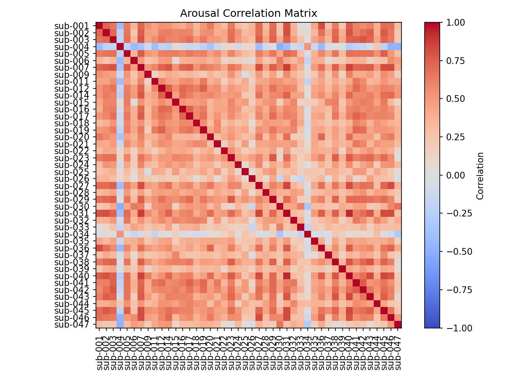
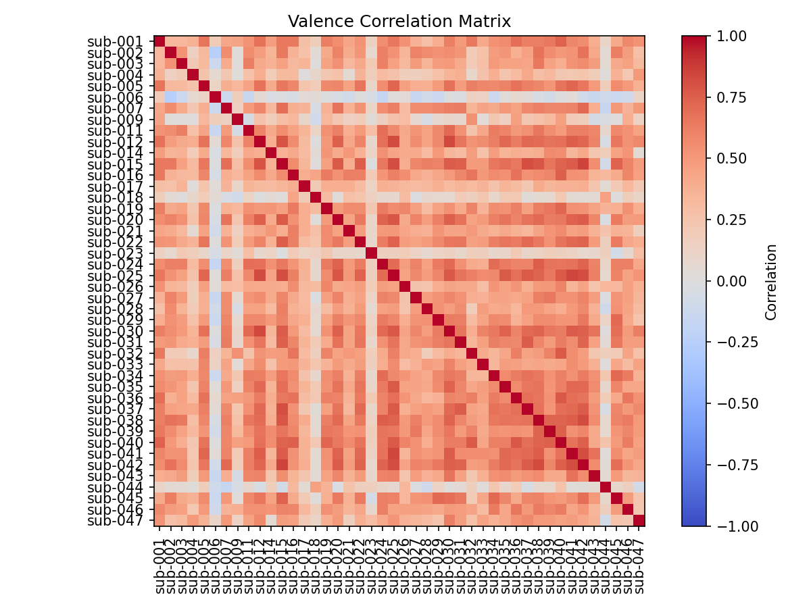

# Explorative Analyses

The exploratory analyses presented here aim to reveal underlying patterns, quantify variability, and assess the reliability and structure of the data before proceeding with deeper modeling or hypothesis testing.

